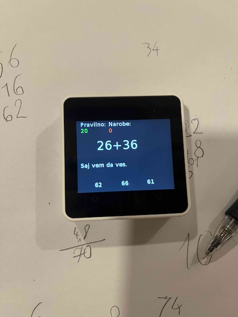
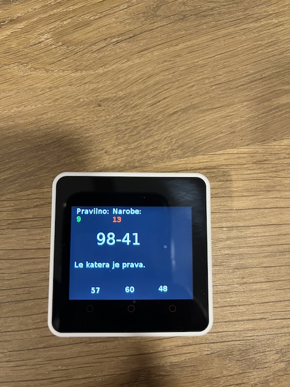

# m5stackprojects
Simple projects using m5stack devices. 

Due that I am lazy teaching my kids math I started to create simple math problems. For now all are in separated files but I am planing to create full app.
All is done through UiFlow v2.0 and I am using Core2 device - probably others will work. 

Benefits:
- We are more global warming aware so we save on paper, pencils, sharpeners, printer toners and so on. 
- no distraction from other apps.
- maybe kids safe
- It saves time searching for math problems. 
- Low power device so no more high bills printing your stuff
- You can justify your buy to your partner
- You can use GO-TO term 

Inspired from: https://github.com/VolosR/M5CoreMath

# Setup environment 
Jump to https://m5stack.com/uiflow and download or use web browser. I will write maybe detailed instructions(but I am lazy so dunno when).

# Programs

## Math Folder

### addition.m5f2  - 

Calculate two numbers (from 0-100) by choosing from 3 answers. It will give you random quote for busting morale( ok wife said they need to first do math and then reading - so I combined it :smile: )
Right answer is from 0-100. 

### subtraction.m5f2 - working with -

Subtract two numbers  (from 0-100) by choosing from 3 answers. It will give you random quote for busting morale. 
Right answer is from 0-100. No negative numbers(for now)

# To do
- group all in one app
- added other math problems
- chose exercises 
- other language support